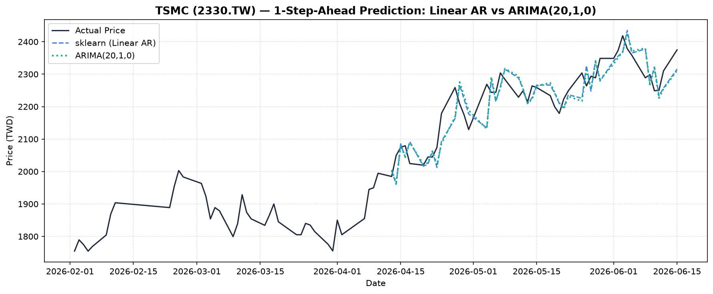
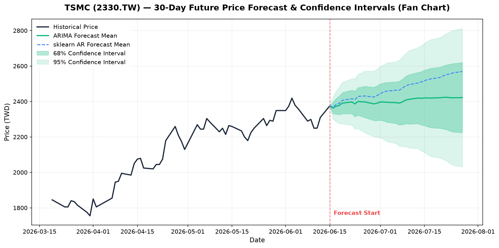

# 台積電 (2330.TW) 股價預測與比較：Linear AR vs. ARIMA

本專案使用 `yfinance` 獲取台積電（2330.TW）歷史股價資料，並實作與比較兩種時間序列模型在**單步滾動預測（1-step-ahead rolling forecast）**上的表現：
1. **sklearn Linear Regression (Lag = 20)**：使用過去 20 天的收盤價作為特徵進行線性自迴歸。
2. **statsmodels ARIMA(20, 1, 0)**：自迴歸整合移動平均模型。

---

## 📊 預測結果比較

依據最近一年的歷史數據訓練與測試（最後 20% 作為測試集），兩模型的表現如下：

| 模型 | RMSE (均方根誤差) | R² Score (決定係數) |
| :--- | :---: | :---: |
| **Linear AR (Lag=20)** | 52.33 | 0.7656 |
| **ARIMA(20, 1, 0)** | 53.18 | 0.7579 |

*註：RMSE 越低越好，R² 越接近 1 越好。在此數據集下，簡易的 Linear AR 表現略優於 ARIMA。*

### 📈 1-Step-Ahead 預測走勢圖
在執行程式後會產生歷史測試集對比圖 `comparison.png`：



---

## 🔮 未來 30 天預測與信賴區間（喇叭圖）

為評估未來 30 天的股價走勢，我們使用全量數據重新訓練模型並進行多步未來預測：
- **statsmodels ARIMA(20, 1, 0)**：進行 30 步的多步預測，並計算出它的 **68% 信賴區間**（約 ±1 倍標準差）與 **95% 信賴區間**（約 ±2 倍標準差），隨著預測天數增加，預測的不確定性會擴大，呈現經典的「喇叭狀 / 扇形（Fan Chart）」擴散。
- **sklearn Linear AR (遞迴預測)**：使用遞迴方式（Recursive Forecast）預測未來 30 天的中心值。

### 📈 未來 30 天預測信賴區間圖
執行程式後會產生未來 30 天預測的「喇叭圖」 `future_forecast.png`：



*圖中紅色虛線為預測起點，向右延伸的綠色陰影區域即為 ARIMA 模型預測的信賴區間，能清晰展現未來股價波動的不確定性範圍。*

---

## 🛠️ 安裝與執行說明

### 1. 安裝依賴套件
執行前請確認已安裝以下 Python 套件：
```bash
pip install numpy pandas yfinance scikit-learn statsmodels matplotlib
```

### 2. 執行預測程式
```bash
python predict_compare.py
```
執行後將會：
- 下載最新一年的 2330.TW 歷史數據。
- 進行模型訓練與預測（包含 1-Step-Ahead 測試集驗證與未來 30 天預測）。
- 於終端機輸出預測的評估指標、明日股價預測值，以及未來 30 天預測信賴區間的詳細表格。
- 輸出兩張視覺化圖表：
  - `comparison.png`：歷史測試集單步預測驗證對比圖。
  - `future_forecast.png`：未來 30 天預測與信賴區間喇叭圖。

---

## 📁 專案檔案結構
* `predict_compare.py`：主程式邏輯。
* `comparison.png`：歷史測試集預測比較圖表。
* `future_forecast.png`：未來 30 天預測信賴區間喇叭圖。
* `CLAUDE.md`：開發與編碼規範指引。
* `log.md`：對話 Prompt 與模型疊代歷程紀錄。
* `README.md`：專案說明文件（本檔案）。